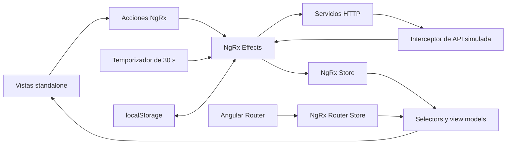

# SPEC 01 — Dashboard industrial de transformación de acero

**Estado:** Implementado  
**Fecha:** 2026-09-18  
**Depende de:** Ninguna  
**Objetivo:** Construir un MVP profesional en Angular para supervisar una planta de transformación de acero mediante OEE, producción, calidad, paros y alertas.

## Alcance

### Incluido

- Tres vistas lazy-loaded: resumen de planta, detalle de línea y centro de alertas.
- Supervisión de una planta de transformación de acero con las etapas Corte, Conformado, Soldadura y Acabado.
- Indicadores OEE, disponibilidad, rendimiento, calidad, producción frente a meta, scrap y minutos de paro.
- Filtros por planta, línea y turno reflejados en la URL.
- API HTTP simulada, desacoplada y sustituible por un backend real.
- Actualización automática cada 30 segundos sin solicitudes solapadas.
- Preferencias visuales persistidas en `localStorage`.
- Optimización para escritorio y tablet, con adaptación funcional para móvil.
- Estados de carga, vacío, error y datos desactualizados.
- Navegación accesible por teclado, foco visible y soporte de movimiento reducido.
- Pruebas de reducers, selectors, effects, servicios HTTP y flujos principales.
- Documentación de instalación, arquitectura, pruebas y sustitución de la API simulada.

### Fuera del alcance

- Backend, base de datos o telemetría reales.
- OPC UA, MQTT, WebSockets o streaming.
- Autenticación y autorización.
- Reconocimiento o resolución manual de alertas.
- Edición de metas, órdenes de producción o causas de paro.
- Analítica histórica avanzada.
- Internacionalización.
- Modo offline o PWA.
- CI/CD y despliegue productivo.

## Decisiones técnicas

- Angular `22.1.7` con componentes standalone, TypeScript estricto y lazy loading.
- NgRx `22.0.1` mediante `@ngrx/store`, `@ngrx/effects`, `@ngrx/entity`, `@ngrx/router-store` y `@ngrx/store-devtools`.
- Angular CDK `22.1.7` para foco y utilidades accesibles, con componentes visuales propios.
- Apache ECharts `6.1.0`, integrado directamente mediante un adaptador Angular e imports modulares.
- Vitest como framework de pruebas predeterminado de Angular 22.
- Dependencias instaladas con versiones exactas y archivo de bloqueo conservado.
- NgRx se reserva para estado compartido, asíncrono o persistente. Los estados efímeros de componentes permanecen en signals locales.
- Router Store es la fuente de verdad para los filtros compartibles; no se duplican en otro slice.

## Propuesta funcional

### Resumen de planta

1. Selector de planta y turno.
2. Franja de actualización con hora de última lectura y estado de conexión.
3. Mapa horizontal Corte → Conformado → Soldadura → Acabado.
4. Estado de cada línea: operativa, rendimiento reducido, parada o sin datos.
5. Banda de indicadores:
   - OEE.
   - Disponibilidad.
   - Rendimiento.
   - Calidad.
   - Unidades producidas frente a meta.
   - Scrap.
   - Minutos de paro.
6. Tendencia OEE del turno.
7. Producción por hora frente a meta.
8. Pareto de causas de paro.
9. Resumen de alertas activas.

### Detalle de línea

- Estado actual y orden de producción simulada.
- OEE y sus tres componentes.
- Producción por hora.
- Evolución temporal del estado.
- Paros por causa y duración.
- Defectos de calidad.
- Historial reciente de eventos.
- Navegación contextual desde el mapa de planta y las alertas.
- Estado específico para identificadores de línea inexistentes.

### Centro de alertas

- Alertas activas y resueltas.
- Severidad, planta, línea, descripción, inicio y duración.
- Filtros por severidad, estado y línea.
- Navegación al detalle de la línea afectada.
- Interfaz de solo consulta, sin reconocimiento ni resolución manual.

## Modelo de datos

### `Plant`

- `id`: identificador estable.
- `name`: nombre visible.
- `location`: ubicación.
- `lineIds`: líneas disponibles.

### `ProductionLine`

- `id`: identificador estable.
- `plantId`: planta propietaria.
- `name`: nombre visible.
- `stage`: `cutting | forming | welding | finishing`.
- `status`: `operational | reduced | stopped | noData`.
- `activeOrder`: orden activa o `null`.

### `Shift`

- `id`: identificador estable.
- `name`: nombre visible.
- `startTime`: inicio.
- `endTime`: fin.

### `ProductionSnapshot`

- `lineId`: línea medida.
- `timestamp`: instante de lectura.
- `producedUnits`: unidades producidas o `null`.
- `targetUnits`: meta o `null`.
- `goodUnits`: unidades buenas o `null`.
- `scrapUnits`: unidades rechazadas o `null`.
- `plannedMinutes`: tiempo planificado o `null`.
- `operatingMinutes`: tiempo operativo o `null`.
- `downtimeMinutes`: tiempo de paro o `null`.

### `OeeMetrics`

- `oee`: valor normalizado o `null`.
- `availability`: valor normalizado o `null`.
- `performance`: valor normalizado o `null`.
- `quality`: valor normalizado o `null`.

### `TrendPoint`

- `timestamp`: instante del punto.
- `actual`: valor real o `null`.
- `target`: valor objetivo o `null`.

### `DowntimeEvent`

- `id`: identificador estable.
- `lineId`: línea afectada.
- `reason`: causa del paro.
- `startedAt`: inicio.
- `endedAt`: fin o `null`.
- `durationMinutes`: duración o `null`.

### `QualityDefect`

- `category`: categoría del defecto.
- `count`: cantidad.
- `percentage`: porcentaje o `null`.

### `IndustrialAlert`

- `id`: identificador estable.
- `plantId`: planta afectada.
- `lineId`: línea afectada.
- `severity`: `info | warning | critical`.
- `status`: `active | resolved`.
- `message`: descripción operativa.
- `startedAt`: inicio.
- `resolvedAt`: resolución o `null`.

### `DashboardPreferences`

- `density`: `comfortable | compact`.
- `navigationCollapsed`: estado de la navegación lateral.

Los valores desconocidos se representan con `null`, nunca con cero. Los selectors protegen divisiones por cero y producen view models consistentes.

## Arquitectura



Estructura prevista:

```text
src/app/
├── core/
│   ├── api/
│   ├── mock-api/
│   └── storage/
├── layout/
├── shared/
│   ├── ui/
│   └── charts/
├── domains/
│   ├── operations/
│   │   ├── models/
│   │   ├── data-access/
│   │   └── state/
│   └── alerts/
│       ├── models/
│       ├── data-access/
│       └── state/
└── features/
    ├── overview/
    ├── line-detail/
    └── alerts/
```

### Estado NgRx

- `operations`: plantas, líneas, snapshots, tendencias, paros, calidad, carga, error y última actualización.
- `alerts`: colección normalizada con NgRx Entity, filtros y estado de consulta.
- `preferences`: densidad y navegación persistidas en `localStorage`.
- `router`: planta, línea y turno como fuente única de verdad para filtros compartibles.

Los effects gestionan carga inicial, cambios de filtro, polling, persistencia y errores. Cambiar filtros cancela consultas obsoletas; el refresco periódico no genera solicitudes solapadas. Ante un fallo se conserva el último resultado válido y se marca como desactualizado.

## API simulada

```text
GET /api/plants
GET /api/plants/:plantId/overview?shiftId=:shiftId
GET /api/lines/:lineId?shiftId=:shiftId
GET /api/alerts?plantId=:plantId&shiftId=:shiftId
```

Un interceptor funcional devuelve fixtures tipadas con latencia simulada. La URL base y el proveedor mock permanecen desacoplados para sustituirlos por una API real sin modificar componentes, reducers o selectors.

## Diseño visual

### Dirección

Panel de control de transformación de acero, evitando una cuadrícula genérica de tarjetas SaaS. El elemento distintivo es el mapa lineal del proceso, que permite localizar rápidamente el flujo o la detención de producción.

### Tokens

- Acero claro `#E3E8EB`: fondo.
- Grafito `#182227`: texto y navegación.
- Azul de proceso `#126782`: selección y datos operativos.
- Verde estable `#2F7D62`: operación normal.
- Ámbar preventivo `#C77A10`: rendimiento reducido.
- Rojo de falla `#B33B3B`: alarmas críticas.

Los estados incluyen icono, texto y patrón; no dependen únicamente del color.

### Tipografía

- IBM Plex Sans Condensed para cifras, estados y cabeceras operativas.
- IBM Plex Sans para navegación y contenido.
- Fuentes autohospedadas, fallback de sistema y licencia documentada.

### Composición de escritorio

```text
┌──────────────────────────────────────────────────────────────┐
│ Navegación │ Planta / Turno        Última lectura · Estado  │
├────────────┼─────────────────────────────────────────────────┤
│            │ Corte ── Conformado ── Soldadura ── Acabado    │
│            ├─────────────────────────────────────────────────┤
│            │ OEE │ Disponib. │ Rendim. │ Calidad │ Producción│
│            ├───────────────────────────┬─────────────────────┤
│            │ Tendencia OEE             │ Producción por hora │
│            ├───────────────────────────┼─────────────────────┤
│            │ Pareto de paros           │ Alertas activas     │
└────────────┴───────────────────────────┴─────────────────────┘
```

Los paneles utilizan bordes funcionales, esquinas mínimas y casi ninguna sombra. En tablet se colapsa la navegación; en móvil los bloques se apilan y las tablas disponen de desplazamiento interno.

## Plan de implementación

### 1. Crear la base ejecutable y verificable de Angular 22

- Generar una aplicación standalone con routing, SCSS, TypeScript estricto y Vitest.
- Fijar Angular `22.1.7`, Angular CDK `22.1.7`, NgRx `22.0.1` y ECharts `6.1.0`.
- Configurar scripts de build, test y análisis estático.
- Crear rutas iniciales con redirección a `/overview`.
- Probar el arranque y la redirección predeterminada.
- Verificar test y build de producción.

### 2. Implementar el sistema visual y el shell responsive

- Incorporar tokens, tipografía, escalas, focos y breakpoints.
- Crear navegación lateral, barra de contexto y enlaces hacia resumen, detalle y alertas.
- Probar navegación activa, colapso del menú, teclado y restauración básica de preferencias.
- Verificar el shell en escritorio, tablet y móvil.

### 3. Construir el primer flujo vertical con API simulada y NgRx

- Definir modelos y contratos.
- Crear fixtures e interceptor mock.
- Implementar servicio HTTP, acciones, reducer, effects y selectors de `operations`.
- Mostrar carga, resultado y error en el resumen.
- Probar contratos, servicio, reducer, selectors y effects para éxito y error HTTP.

### 4. Entregar el resumen operativo de planta

- Crear el mapa Corte–Conformado–Soldadura–Acabado.
- Incorporar banda de KPIs y estados de línea.
- Calcular view models mediante selectors.
- Enlazar las líneas con su detalle.
- Probar OEE, valores nulos, divisiones por cero, estados y navegación.

### 5. Añadir analítica visual integrada

- Crear un adaptador standalone de ECharts con limpieza de recursos y resize.
- Integrar tendencia OEE, producción horaria y Pareto de paros.
- Añadir resúmenes textuales accesibles.
- Probar transformación de datasets, configuración, actualización, destrucción y alternativa textual.

### 6. Incorporar filtros, polling, persistencia y degradación

- Sincronizar filtros con Router Store.
- Ejecutar polling cada 30 segundos sin solapamientos.
- Persistir preferencias visuales.
- Conservar los datos previos ante fallos y mostrar su antigüedad.
- Probar tiempo virtual, cambios rápidos, cancelación, error de refresco, hidratación y URL inválida.

### 7. Entregar el detalle operativo de línea

- Crear la ruta lazy `/lines/:lineId`.
- Mostrar snapshot, orden, OEE, producción, paros, defectos e historial.
- Reutilizar estado y componentes compartidos.
- Manejar identificadores inexistentes.
- Probar parámetros de ruta, navegación, datos parciales y eventos.

### 8. Entregar el centro de alertas

- Crear el estado normalizado con NgRx Entity.
- Implementar servicio, effects, selectors, filtros y tabla responsive.
- Conectar las alertas con el detalle de línea.
- Probar normalización, orden, filtros combinados, vacío, error y navegación.

### 9. Integrar, endurecer y documentar el MVP

- Revisar responsive, contraste, teclado, movimiento reducido y textos.
- Añadir pruebas de flujos completos.
- Eliminar código huérfano y optimizar imports de ECharts.
- Documentar arquitectura, comandos, fixtures y reemplazo del mock.
- Ejecutar suite unitaria e integrada, análisis estático y build.
- Validar manualmente a 390, 768 y 1440 píxeles.

## Criterios de aceptación

- [x] La aplicación utiliza Angular `22.1.7` y NgRx `22.0.1` con versiones exactas.
- [x] Las tres vistas funcionan mediante rutas lazy-loaded.
- [x] El resumen muestra todos los indicadores OEE acordados.
- [x] Los filtros actualizan la URL y sobreviven a una recarga.
- [x] Los datos se actualizan cada 30 segundos sin solicitudes solapadas.
- [x] Un error de refresco conserva y marca el último dato válido.
- [x] Las preferencias visuales se restauran desde `localStorage`.
- [x] Todas las vistas presentan estados de carga, vacío y error.
- [x] Las alertas y líneas permiten navegación contextual.
- [x] La aplicación no presenta desbordamiento general a 390, 768 y 1440 píxeles.
- [x] Todas las acciones son operables por teclado y tienen foco visible.
- [x] Los gráficos ofrecen resumen textual y alternativa accesible.
- [x] Reducers, selectors, effects y servicios HTTP tienen pruebas de comportamiento.
- [x] Los flujos de navegación, filtros, error y refresco tienen pruebas integradas.
- [x] Tests, análisis estático y build de producción finalizan correctamente.
- [x] El README documenta instalación, ejecución, pruebas, arquitectura y sustitución del mock.

> Verificación de cierre (2026-09-18): todos los criterios de aceptación fueron revisados y aprobados. La implementación cuenta con auditoría responsive para 390, 768 y 1440 píxeles, regiones de overflow contenidas y 88 pruebas que cubren componentes, estado, routing, filtros, errores, polling, refresco y persistencia.

## Decisiones tomadas y descartadas

- Se adopta Angular 22 por encontrarse en soporte activo; se descartan Angular 20 y 21 por estar en LTS.
- Se adopta NgRx Store para estado global y signals para estado efímero; se descarta almacenar cada interacción local en el store.
- Se integra ECharts directamente; se descarta un wrapper adicional para reducir dependencias y controlar el ciclo de vida.
- Se usa una API simulada mediante HTTP e interceptor; se descartan datos importados directamente por los componentes porque dificultarían sustituir el mock.
- Se utiliza una interfaz clara de sala de control; se descartan el modo oscuro neón y las tarjetas SaaS genéricas.
- No se incluye autenticación para concentrar el MVP en el flujo operativo.
- No se permiten mutaciones operativas: alertas, metas y paros son de solo lectura.

## Riesgos identificados

- La amplitud de NgRx puede sobredimensionar un MVP; se mitiga limitando el store a estado compartido y efectos reales.
- Un mock demasiado acoplado puede ocultar diferencias con el backend futuro; se mitiga con contratos HTTP explícitos y servicios desacoplados.
- Los gráficos canvas pueden reducir la accesibilidad; se mitiga con descripciones, resúmenes textuales y patrones visuales.
- El polling puede provocar condiciones de carrera; se mitiga cancelando consultas obsoletas y evitando solicitudes solapadas.
- Las métricas incompletas pueden confundirse con cero; se mitiga usando `null` y estados visuales de datos no disponibles.
